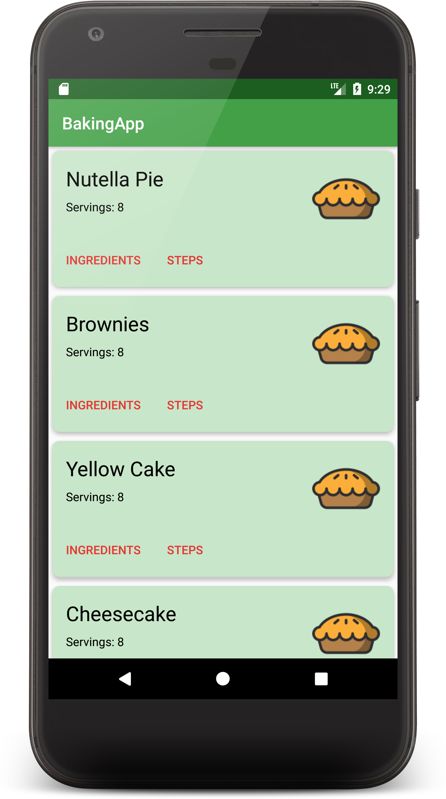

# BakingApp
BakingApp is an app that allows users to see baking recipes and the steps for their preparation by playing videos. It also displays the last visited recipe in a widget.

## Main tools and libraries used
 - Fragments
 - ViewPager
 - RecyclerView
 - CardView
 - [ExoPlayer](https://github.com/google/ExoPlayer)
 - [Espresso](https://google.github.io/android-testing-support-library/docs/index.html)
 - [Glide](https://github.com/bumptech/glide)

## Screenshots

